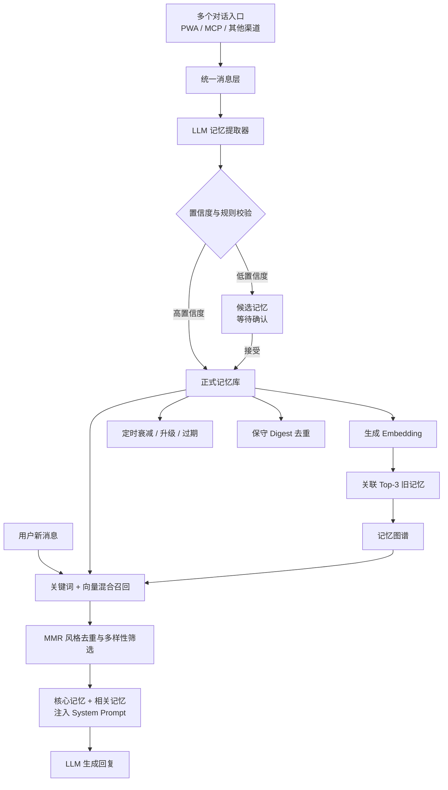
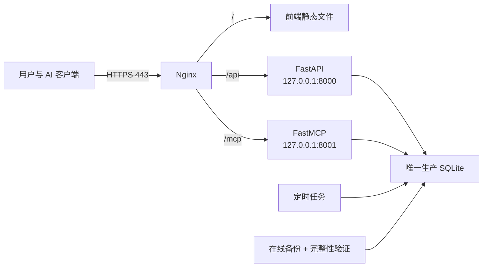

# 如何让 AI 真正“记得你”：一套长期记忆系统的拆解与搭建规格

> 这不是一份逐行照抄的服务器手册。前半部分写给想理解产品的人，后半部分写给帮你实现系统的 AI 或开发者。

---

# 上篇：给人看的产品拆解

## 1. AI 的“记忆”到底是什么？

大模型本身并不会像人一样，自动把每次对话变成稳定的长期记忆。

它在一次对话中能“记得”前文，主要是因为前文仍在当前的上下文窗口里。窗口被截断、对话换了入口，或服务重启后，这种“记得”就可能消失。

所以，一套可靠的 AI 记忆系统，本质上是在模型外面加了一个长期存储和调度层：

1. 从聊天中找出值得记住的事。
2. 把它们变成结构化记忆，存入数据库。
3. 新的记忆会和旧记忆建立关联。
4. 每次回复前，只找出当下最有关的几条。
5. 把这几条放进提示词，再让模型回答。
6. 随着时间进行衰减、升级、解决和去重。

因此，它不是“让模型拥有神秘的永久记忆”，而是“在正确的时候，把正确的记忆重新交给模型”。

## 2. 整体架构：一条记忆如何流动



这套架构有一个非常关键的原则：**写就是读**。

一条新记忆写入时，系统不是只做一次 `INSERT`，而是同时去查找最相关的旧记忆。这让记忆不再是一叠孤立卡片，而是逐渐长成一张关系网。

## 3. 四层记忆：不是每件事都同样重要

| 层级 | 它装什么 | 行为 |
|---|---|---|
| `core` 核心记忆 | 身份、关系基石、重要边界、核心日期 | 每次对话都带上，不衰减，默认固定 |
| `long` 长期记忆 | 偏好、长期目标、重要经历、稳定事实 | 缓慢衰减，被召回时增强 |
| `short` 短期记忆 | 近期安排、临时状态、几天内有用的事 | 衰减更快，可过期，多次被用到可升为长期 |
| `consciousness` 意识记忆 | AI 的高质量感悟、对关系的理解变化 | 不衰减，不应该被流水账自动填充 |

这个分层会让 AI 同时具备两种能力：既不忘记“我们是谁”，又不会把“今天下雨了”永久当成最高优先级。

> 注意：四层是产品工程分层，不是对人类大脑的一比一还原。它受“工作记忆—长期记忆”思路启发，但核心目的是可控、可解释和可运维。

## 4. 候选先行：避免 AI 把误解当成事实

记忆系统最危险的错误，不是“忘了”，而是“记错了，还一直相信自己”。

所以这里使用了候选缓冲区：

- LLM 每次从最近对话中提取 0–5 条值得记住的信息。
- 同时标注类型、层级、标签、日期、情绪和置信度。
- 置信度较高的明确事实可直接进入正式库。
- 不够确定的内容留在候选区，由用户接受或拒绝。
- 入库前还要再做一次确定性去重。

它类似人类的“编码—巩固”过程：对话中的瞬时信息不会全部成为长期记忆，只有通过价值判断和校验的部分才会被保留。

## 5. 记忆不是目录，而是一张图

每当新记忆写入，系统会同时找出 Top-3 相关旧记忆，并建立 `relates_to` 连线。

例如：

- 新记忆：“她报名了九月的法语 B2 考试。”
- 可能关联：“她正在学法语”、“她想去法语区生活”、“她上次考试前很紧张”。

这会产生两个价值：

1. AI 想起的不是一个孤立事实，而是一串相互解释的经历。
2. 产品可以把这些联系可视化，让用户看见 AI 为什么想起了这件事。

这和心理学里的“联结网络”、计算机里的“知识图谱”有相似性，但本实现更轻量：节点是记忆，边是带权相关关系，不追求完整的世界知识建模。

## 6. 召回：为什么要同时用关键词和向量？

只用关键词，会漏掉“意思相同、措辞不同”的内容。

只用向量，又可能在人名、日期、缩写和准确短语上失手，还可能因为向量模型的“背景相似度”而召回一堆似是而非的内容。

所以这里用双通道：

- **词法通道**：完整短语、中文双字组和标签匹配。
- **语义通道**：用 Embedding 把文本变成向量，再计算余弦相似度。
- **合并排序**：两路都命中时获得加成，再结合记忆层级、权重、情绪强度和未完成状态。
- **多样性筛选**：避免最终的 5 条记忆只是同一件事的 5 种说法。

这是一种轻量的 Hybrid RAG（混合检索增强生成）。不同之处在于：检索对象不是文档分块，而是有生命周期、情感属性和关系连线的个人记忆。

## 7. 记忆也会“用进废退”

记忆被召回后，权重会小幅增加。为了防止用户在一次对话里反复问同件事就把它“刷满”，同一条记忆 6 小时内只计一次有效触发。

- 短期记忆被有效召回 3 次，可升级为长期记忆。
- 长期记忆在 24 小时内没被用到时，每日权重乘以 `0.995`，但不低于 `0.3`。
- 短期记忆每日权重乘以 `0.95`，但不低于 `0.05`。
- 核心、意识、已固定和仍未解决的记忆不参与普通衰减。
- 普通短期记忆默认 30 天后可过期。

这个机制受遗忘曲线和间隔重复思路启发，但它不是对 Ebbinghaus 曲线的严格复刻。它是一个为产品可解释性服务的离散衰减模型。

## 8. 情绪不等于正负面标签

每条记忆可以有两个 0–1 之间的值：

- `valence`：感受是偏消极还是偏积极。
- `arousal`：情绪唤醒强度，是平静还是强烈。

这来自 Russell 情绪环状模型的二维思路。例如，“放松”和“兴奋”都可以是积极的，但它们的唤醒度完全不同。

在召回中，高 `arousal` 记忆会获得最多 15% 的适度加成。这表达的不是“越情绪化越重要”，而是“强烈经历在相关性相近时，更值得被想起”。

## 9. 未完成记忆：让 AI 记得关系中的“还没有”

记得一个人喜欢什么很容易，真正体现连续性的，往往是记得她还在等什么、担心什么、答应了什么。

`unresolved` 记忆有几个特性：

- 召回时获得 8% 加成。
- 不参与普通衰减和过期删除。
- 在 AI “醒来”时可作为未完成上下文浮现。
- 用户或 AI 可以调用 `resolve()` 把它标为已解决，但不删除历史。
- 解决后仍然可搜索，但召回权重会降低，避免旧任务继续抢占当下注意力。

这和 Zeigarnik Effect（未完成任务更容易占据注意）在直觉上相似，但这里是一个显式的产品规则，不是对心理学效应的实验模拟。

## 10. 为什么不把全部聊天记录塞给模型？

这套记忆系统的核心优势有五个：

1. **更省 token**：每次只注入核心记忆和 Top-K 相关记忆，不需要反复传入整段历史。
2. **更少噪声**：模型看到的是当下需要的几条，而不是几万句对话。
3. **跨模型、跨入口**：只要 PWA、MCP 和其他入口指向同一个后端和数据库，换模型不会换掉关系。
4. **可编辑、可删除、可审计**：用户能看到 AI 记了什么，也能纠正它。
5. **可生长**：记忆会建立联系、变强、衰减、升级和整理，而不是只增不减。

## 11. 为什么本地只看到少量记忆，线上却接近 900 条？

因为 SQLite 是一个文件数据库。本地开发环境和云服务器各有自己的 `.db` 文件，它们不会因为代码通过 Git 同步就自动合并。

线上实际拓扑是：

```text
手机 / 电脑 / AI 客户端
            ↓ HTTPS
          Nginx
       ↙          ↘
 FastAPI API        MCP Server
       ↘          ↙
     同一个生产 SQLite
```

所以，云端记忆数量才是真正持续运行的那一份。本地数据库可能是旧快照、测试库或空库。

最重要的运维原则是：

- 用明确的 `DATABASE_PATH` 指向唯一生产库。
- FastAPI 和 MCP 必须共用它，不要各建一个相对路径数据库。
- 不要用普通 `cp` 复制正在 WAL 模式运行的库，要用 SQLite 在线备份 API。
- 备份后验证 SHA-256、`PRAGMA quick_check` 和记忆数量。
- 云服务器上的备份仍在同一块磁盘，还要定期下载离线副本。

## 12. 这套系统的特点和不足

### 特点

- 它把“记住”和“想起”分开，便于独立调优。
- 有候选库，不把 LLM 判断当成绝对事实。
- 中文召回不依赖空格分词，用双字组做稳定词法信号。
- 语义阈值来自真实数据分布校准，而不是凭感觉选一个数。
- 召回会反过来影响记忆强度，形成可解释的生命周期。
- Digest 不盲信 LLM，LLM 只提议，代码负责验证和事务。

### 不足

- 当前 SQLite 实现会在召回时扫描记忆并在 Python 中计算向量，近 900 条可用，数万条时需要向量索引。
- 自动提取依赖 LLM 输出质量，候选机制只能降低风险，不能消除误判。
- 双字组简单稳定，但不是真正的语言理解。
- 权重和阈值是产品参数，应根据自己的数据重新校准。
- 当前记忆连线表达“相关”，还不能表达冲突、更新、因果和时序等更复杂关系。

---

# 下篇：给 AI 看的技术规格

> 你可以把下面的内容连同你的产品需求一起交给编码 AI。请让 AI 先生成实施计划和迁移方案，不要直接改动生产数据。

## 13. 目标与非目标

### 目标

实现一个与模型供应商解耦的长期记忆服务，具备：

- 对话后异步提取记忆候选。
- 高置信度入库，低置信度人工审核。
- `core / long / short / consciousness` 四层存储。
- `fact / event / unresolved / date / consciousness` 类型。
- 写入时语义关联 Top-3。
- 中文词法 + Embedding 混合召回。
- 权重、情绪、未完成状态和多样性排序。
- 衰减、升级、过期、resolve 和安全去重。
- PWA API 和 MCP 共用同一个数据库。
- 可观测、可备份、可恢复。

### 非目标

- 不假装记忆是模型参数的一部分。
- 不保存模型的私有思维链。
- 不在没有相关信号时随机塞入“最近记忆”充数。
- 不允许 LLM 未经确定性验证直接删除记忆。

## 14. 参考组件

| 层 | 可选实现 |
|---|---|
| 应用入口 | React / Vue / 原生 App / 聊天机器人 |
| API | FastAPI，也可替换为其他 Web 框架 |
| 主数据库 | 单用户可用 SQLite WAL；多用户或大规模改用 Postgres |
| 向量 | 任何稳定的多语言 Embedding API，同一库不要混用不同维度和模型 |
| 后台任务 | APScheduler / Celery / 系统 cron |
| AI 工具协议 | FastMCP Streamable HTTP 或 stdio |
| 入口网关 | Nginx / Caddy |

## 15. 最小数据模型

```sql
CREATE TABLE memory_candidates (
  id TEXT PRIMARY KEY,
  conversation_id TEXT,
  content TEXT NOT NULL,
  tags_json TEXT,
  proposed_memory_type TEXT,
  proposed_layer TEXT,
  proposed_event_date TEXT,
  proposed_valence REAL DEFAULT 0.5,
  proposed_arousal REAL DEFAULT 0.0,
  proposed_unresolved INTEGER DEFAULT 0,
  confidence REAL DEFAULT 0.5,
  status TEXT DEFAULT 'pending',
  created_at TEXT NOT NULL
);

CREATE TABLE memories (
  id TEXT PRIMARY KEY,
  content TEXT NOT NULL,
  tags_json TEXT,
  layer TEXT NOT NULL DEFAULT 'long',
  memory_type TEXT NOT NULL DEFAULT 'fact',
  event_date TEXT,
  event_time TEXT,
  timezone TEXT DEFAULT 'Asia/Shanghai',
  expires_at TEXT,
  weight REAL NOT NULL DEFAULT 1.0,
  decay_rate REAL NOT NULL,
  valence REAL NOT NULL DEFAULT 0.0,
  arousal REAL NOT NULL DEFAULT 0.0,
  pinned INTEGER NOT NULL DEFAULT 0,
  unresolved INTEGER NOT NULL DEFAULT 0,
  last_triggered_at TEXT,
  trigger_count INTEGER NOT NULL DEFAULT 0,
  embedding BLOB,
  source_candidate_id TEXT,
  created_at TEXT NOT NULL,
  updated_at TEXT NOT NULL
);

CREATE TABLE memory_links (
  id TEXT PRIMARY KEY,
  source_id TEXT NOT NULL REFERENCES memories(id) ON DELETE CASCADE,
  target_id TEXT NOT NULL REFERENCES memories(id) ON DELETE CASCADE,
  link_type TEXT NOT NULL DEFAULT 'relates_to',
  weight REAL NOT NULL DEFAULT 0.5,
  created_at TEXT NOT NULL,
  UNIQUE(source_id, target_id, link_type)
);

CREATE TABLE memory_recall_logs (
  id TEXT PRIMARY KEY,
  query_hash TEXT NOT NULL,
  keyword_hits INTEGER NOT NULL DEFAULT 0,
  semantic_hits INTEGER NOT NULL DEFAULT 0,
  result_count INTEGER NOT NULL DEFAULT 0,
  latency_ms REAL NOT NULL DEFAULT 0,
  created_at TEXT NOT NULL
);
```

必须维持的不变量：

- `memory_type = unresolved` 时，初始 `unresolved = 1`。
- `resolve()` 只把活跃状态变为 `0`，不删除原条目。
- `core` 默认 `pinned = 1`。
- `core` 和 `consciousness` 的衰减率为 `0`。
- 连线不得指向自己，不得引用不存在的记忆，不得重复。
- 修改记忆正文后必须重新生成 Embedding；生成失败时要清空旧向量，不能保留过期语义。

## 16. 算法与公式

### 16.1 中文双字组

对字符串 `x`，定义：

```text
B(x) = { x[i:i+2] | 0 ≤ i < len(x)-1 }
```

例如 `用户喜欢咖啡` 会变成 `{用户, 户喜, 喜欢, 欢咖, 咖啡}`。

入库前的确定性重复检查可用包含率：

```text
duplicate(x, y) = |B(x) ∩ B(y)| / min(|B(x)|, |B(y)|)
```

参考阈值为 `0.60`，但只扫描最近一定数量记忆时，需接受它不是全局绝对去重。

### 16.2 余弦相似度

```text
cos(a, b) = (a · b) / (||a||₂ ||b||₂)
```

向量通道只保留超过校准阈值的条目。本实例根据生产数据的随机记忆对分布和已有关联记忆分布，使用 `0.70` 作为参考阈值。换 Embedding 模型后必须重新测量，不要直接照搬。

### 16.3 词法分数

```text
exact equality                         → 1.00
query 是 content 的完整子串             → 至少 0.85
query bigram 包含率 × 0.65          → 0.00–0.65
query 与任一 tag 互相包含           → 至少 0.72
```

### 16.4 混合分数

先对语义分数做线性归一化：

```text
s_norm = clamp((s_sem - 0.65) / 0.35, 0, 1)
```

然后合并：

```text
词法和语义都命中: raw = 0.42 * lexical + 0.58 * s_norm + 0.08
只有语义命中:       raw = 0.82 * s_norm
只有词法命中:       raw = lexical
```

加入记忆属性：

```text
final = raw
      * layer_factor
      * (1 + 0.15 * arousal)
      * (0.7 + 0.3 * weight)
```

参考层级因子：`long=1.00`、`short=1.05`、`consciousness=0.88`。

然后：

```text
仍未解决: final *= 1.08
已解决的旧 unresolved 条目: final *= 0.40
```

### 16.5 MMR 风格多样性筛选

先取排名靠前的 `4K` 条候选，再贪心选择 K 条。对每个候选记忆：

```text
redundancy = max(sim(candidate, each_selected))
adjusted = final - 0.5 * max(0, redundancy - 0.72)
```

每轮选择 `adjusted` 最高的条目。这是 MMR 思路的工程变体，不是教科书公式的原样复制。

### 16.6 离散衰减

```text
w(t+1) = max(floor, w(t) * decay_rate)
```

| 层级 | decay_rate | floor |
|---|---:|---:|
| long | 0.995 | 0.30 |
| short | 0.95 | 0.05 |
| core | 0 | 不衰减 |
| consciousness | 0 | 不衰减 |

仅对最近 24 小时没有被有效召回、且没有固定、没有未解决的记忆执行。

## 17. 核心流程伪代码

### 对话后写入

```python
async def after_chat(recent_messages):
    proposals = await llm_extract(recent_messages, max_items=5)
    for item in validate_schema(proposals):
        if deterministic_duplicate(item.content):
            continue
        if item.confidence >= 0.70:
            await create_memory(item)
        else:
            await create_candidate(item)

async def create_memory(item):
    embedding = await embed(item.content)
    memory_id = await insert_memory(item, embedding)
    related = await find_top_related(item, exclude=memory_id, limit=3)
    await upsert_links(memory_id, related)
    return memory_id, related
```

### 回复前召回

```python
async def before_reply(user_message):
    core = await load_all_core_and_pinned()
    lexical = lexical_search(user_message)
    semantic = semantic_search(user_message, threshold=CALIBRATED_THRESHOLD)
    merged = score_and_merge(lexical, semantic)
    recalled = diversify(merged, limit=5)
    update_trigger_state_with_cooldown(recalled, hours=6)
    return build_prompt(core=core, recalled=recalled)
```

当没有足够相关的记忆时，返回空集并在 Prompt 中明确要求 AI 不要编造。不要为了凑够 K 条而随机或按最近时间填充。

## 18. 安全 Digest

LLM 在 Digest 中只是“建议者”：

1. 每次只给 LLM 一个小批次，让它返回 `keep_id / delete_ids / reason`。
2. 代码拒绝任何未知 ID、重复请求、自相删除。
3. 保护 `core`、`consciousness`、`pinned`、活跃 `unresolved` 及 unresolved 历史。
4. 只当确定性包含率或语义相似度达到 `0.92` 才允许合并。
5. 保留者合并标签，取较高权重和情绪强度，累加触发次数。
6. 把被删条目的连线重定向到保留者，去掉自环和重复边。
7. 整批放在一个数据库事务里；任一步失败全部回滚。
8. 记录 LLM 原建议、实际执行项、跳过项和删除数量。
9. 用进程内锁防止两个 Digest 同时运行。

## 19. API 与 MCP 最小能力

### HTTP API

```text
GET    /memory?layer=&memory_type=&search=&limit=&offset=
GET    /memory/stats
GET    /memory/heatmap?year=&month=
GET    /memory/{id}/related
POST   /memory/recall
PUT    /memory/{id}
DELETE /memory/{id}
POST   /memory/{id}/move
POST   /memory/{id}/resolve
GET    /memory/candidates
POST   /memory/candidates/{id}/accept
POST   /memory/candidates/{id}/reject
POST   /memory/backfill-embeddings
POST   /memory/digest
```

### MCP tools

```text
remember(content, tags, layer, memory_type, event_date, unresolved)
recall(query, limit)
resolve(memory_id)
resume()
```

MCP 和 HTTP API 不应该各自实现一套记忆算法，它们必须调用同一个 `memory_service`。

## 20. 上云时的系统边界



生产要求：

- 公网只开放 80/443，8000/8001 只监听 `127.0.0.1`。
- 全程 HTTPS，配置 HSTS、CSP、正确的 Host 和 Origin 校验。
- Web API 使用安全会话 cookie 和 CSRF 保护，不把长期 API 密钥放进前端。
- **公网 MCP 必须有独立的 Bearer/OAuth 验证**。不能因为它在 Nginx 后面就默认安全。
- `.env`、密码散列、API key、会话 secret、MCP token 只存在服务器密钥环境。
- 数据库和备份文件权限建议为 `600`，备份目录为 `700`。
- 日志不记录记忆正文、完整查询或认证头；召回观测使用查询哈希。

## 21. 可观测性

不记录私密内容的前提下，每次召回记录：

- `query_hash`：查询的 SHA-256，不保存原文。
- `keyword_hits`：词法通道命中数。
- `semantic_hits`：语义通道命中数。
- `result_count`：最终返回数。
- `latency_ms`：召回耗时。

指标保留期可设为 90 天。还应提供：

- 存活检查：进程是否运行。
- 就绪检查：数据库能否读写、必要配置是否存在。
- 请求 ID 与延迟日志。
- Digest 的建议、执行和跳过审计记录。

## 22. 给编码 AI 的实施顺序

```text
P0  建立唯一数据库路径、WAL、外键、在线备份和恢复演练
P0  建 memories / candidates / links / migrations 表与不变量
P0  实现 create / candidate accept-reject / edit / delete / resolve
P0  实现正文修改后的 Embedding 重算与连线完整性
P0  实现混合召回、空结果不编造、核心记忆注入
P0  保护 Web API 和远程 MCP，禁止匿名读写
P1  写入时关联 Top-3，建立记忆图
P1  实现权重、召回冷却、短转长、衰减和过期
P1  实现保守 Digest 和审计记录
P1  实现记忆管理界面：分层、搜索、编辑、关联、resolve、分页
P1  增加召回指标、健康检查和 90 天清理
P2  根据真实数据校准语义阈值和各项加权
P2  数据达到数万级后迁移 Postgres + pgvector/HNSW 或专用向量库
```

## 23. 验收清单

### 正确性

- 低置信度候选不会自动成为正式记忆。
- 候选接受后，它的层级、类型、情绪和 unresolved 完整传入正式库。
- 编辑正文后不会使用旧 Embedding。
- `resolve()` 保留记忆，但降低其后续召回优先级。
- 删除记忆后没有孤儿连线。
- 无相关结果时返回空集，不用随机记忆填充。
- 召回不会在 6 小时内重复增强同一条记忆。
- Digest 不能删除受保护记忆，低于安全阈值必须跳过。

### 安全与运维

- 匿名请求 Web API 和远程 MCP 都返回 `401/403`。
- 不暴露后端原始端口。
- 备份的 `quick_check` 为 `ok`，记忆数量合理，SHA-256 校验通过。
- 可以把备份恢复到临时库并正常召回记忆。
- 数据库迁移可重复启动，不会重复执行破坏性修改。
- 日志中没有记忆正文、密码、token 或 API key。

### 体验

- 记忆宫殿显示真实总数，而不是当前一页的数量。
- 大于一页的层级可以继续加载。
- 搜索有防抖，加载和操作失败有明确反馈。
- 删除前有确认，服务端失败时界面不会假装成功。
- 按钮和日历交互可用键盘操作，有可见焦点，触控区域不小于 44×44 px。

## 24. 理论与技术来源

下面的来源用于理解思路，不意味着本系统对论文算法进行了原样复制：

- James A. Russell, [A Circumplex Model of Affect](https://doi.org/10.1037/h0077714), 1980：valence/arousal 二维情感表示。
- Jaime Carbonell & Jade Goldstein, [The Use of MMR, Diversity-Based Reranking for Reordering Documents and Producing Summaries](https://doi.org/10.1145/290941.291025), 1998：相关性与多样性重排思路。
- Patrick Lewis et al., [Retrieval-Augmented Generation for Knowledge-Intensive NLP Tasks](https://arxiv.org/abs/2005.11401), 2020：参数化模型与外部非参数记忆的检索增强思路。
- John T. Wixted & Ebbe B. Ebbesen, [On the Form of Forgetting](https://doi.org/10.1111/j.1467-9280.1991.tb00175.x), 1991：遗忘函数形式的实证讨论，也提醒开发者不要把“遗忘曲线”简化成唯一正确公式。
- [Model Context Protocol: Transports](https://modelcontextprotocol.io/specification/2025-11-25/basic/transports)：Streamable HTTP 的 Host/Origin、本机绑定和认证安全要求。
- [FastMCP Token Verification](https://gofastmcp.com/servers/auth/token-verification)：远程 MCP 的 Bearer/JWT/OAuth 验证参考。
- [SQLite Online Backup API](https://www.sqlite.org/backup.html) 与 [Write-Ahead Logging](https://www.sqlite.org/wal.html)：运行中 SQLite 的一致性备份与 WAL 机制。

## 25. 一句话总结

**一套好的 AI 记忆系统，不是什么都记住，而是知道什么值得记、什么时候该想起、什么时候应该淡去，并且始终允许人类纠正它。**
